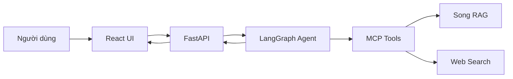
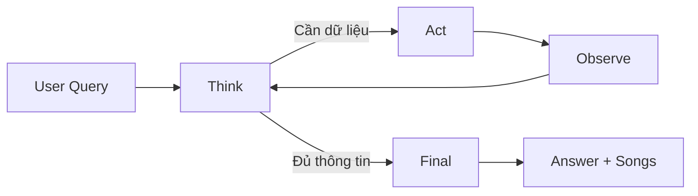
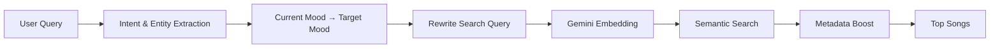
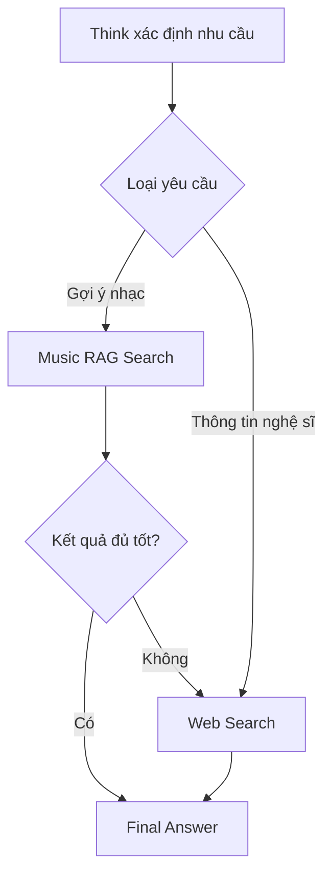
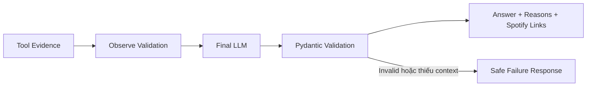

# Khung slide thuyết trình VibeCue

## Định hướng chung

- Thời lượng dự kiến: 10-15 phút.
- Đối tượng: giảng viên và người nghe có nền tảng kỹ thuật.
- Nội dung tập trung vào cách chatbot hiểu cảm xúc và tìm nhạc phù hợp.
- Phần core chatbot chỉ chia thành **4 mục lớn** để câu chuyện liền mạch, không sa vào chi tiết code.

---

# Phần 1 - Overview

## Slide 1 - Giới thiệu đề tài

**Tên đề tài:** VibeCue - Mood-based Music Recommendation Chatbot

**Nội dung chính:**

- Chatbot gợi ý nhạc dựa trên cảm xúc, ngữ cảnh và yêu cầu tự nhiên của người dùng.
- Người dùng không cần chọn thủ công mood, genre hoặc playlist.
- Kết quả gồm tên bài hát, nghệ sĩ, lý do đề xuất và liên kết Spotify.

**Thông điệp trình bày:**

> VibeCue biến một câu mô tả cảm xúc thành một danh sách nhạc có thể nghe ngay.

## Slide 2 - Bài toán và mục tiêu

**Bài toán:**

- Từ khóa tìm kiếm truyền thống không thể hiện đầy đủ cảm xúc của người dùng.
- Cùng một trạng thái cảm xúc nhưng mục tiêu nghe nhạc có thể khác nhau.
- Ví dụ: người dùng đang buồn có thể muốn nghe nhạc buồn, hoặc muốn nghe nhạc giúp tâm trạng tốt hơn.

**Mục tiêu của hệ thống:**

- Hiểu ý định và cảm xúc từ ngôn ngữ tự nhiên.
- Xác định mood âm nhạc phù hợp với mục tiêu người dùng.
- Tìm và xếp hạng các bài hát từ kho dữ liệu.
- Trả lời tự nhiên, có giải thích và không bịa thông tin bài hát.

## Slide 3 - Kiến trúc tổng quan



**Ý chính để trình bày:**

- React chịu trách nhiệm giao tiếp với người dùng.
- FastAPI là cổng tiếp nhận và trả kết quả.
- LangGraph điều khiển quá trình suy luận của chatbot.
- MCP tách agent khỏi các công cụ tìm kiếm bên ngoài.
- Song RAG là nguồn chính; web search đóng vai trò bổ sung.

---

# Phần 2 - Khai phá dữ liệu

## Slide 4 - Khai phá và chuẩn bị dữ liệu âm nhạc

> Phần này do thành viên phụ trách khai phá dữ liệu bổ sung.

Các đề mục dự kiến:

- Nguồn thu thập dữ liệu.
- Tiền xử lý và làm sạch dữ liệu.
- Phân bố mood và đặc trưng bài hát.
- Xây dựng dữ liệu đầu vào cho hệ thống retrieval.

---

# Phần 3 - Core Logic của Chatbot

## Mục 1 - Kiến trúc Agent và Workflow xử lý

### Nội dung chính

Chatbot được xây dựng dưới dạng một agent có trạng thái bằng LangGraph. Thay vì gọi LLM một lần rồi trả lời ngay, hệ thống chia quá trình xử lý thành bốn node:

- **Think:** hiểu yêu cầu, xác định intent và quyết định có cần dùng tool hay không.
- **Act:** gọi đúng tool đã được Think lựa chọn.
- **Observe:** kiểm tra và chuẩn hóa kết quả trả về từ tool.
- **Final:** tạo câu trả lời tự nhiên từ các bằng chứng đã thu thập.

### Workflow cơ bản



### Điểm thiết kế đáng chú ý

- Chỉ node Think và Final sử dụng LLM.
- Act và Observe chạy bằng logic xác định để giảm tính ngẫu nhiên.
- Agent gọi tối đa hai tool, tránh vòng lặp vô hạn và kiểm soát chi phí.
- Greeting hoặc smalltalk có thể đi thẳng từ Think đến Final.

### Ví dụ để thuyết trình

> User: "Gợi ý nhạc nghe lúc buồn nhưng muốn thấy nhẹ nhàng hơn."

Think xác định đây là yêu cầu đề xuất nhạc, trích xuất mood hiện tại, tạo truy vấn tìm kiếm, sau đó chuyển sang Act để gọi Song RAG.

---

## Mục 2 - Hiểu yêu cầu, Mood Intelligence và Music Retrieval

Mục này gộp toàn bộ quá trình từ lúc chatbot đọc câu hỏi đến lúc có danh sách bài hát đã xếp hạng.

### 2.1 Hiểu yêu cầu người dùng

Think node phân tích câu hỏi thành các thông tin có cấu trúc:

- Intent: recommendation, artist deep-dive, smalltalk hoặc out-of-domain.
- Mood hiện tại của người dùng.
- Mood mục tiêu cho âm nhạc.
- Genre, tag, artist và các ràng buộc khác nếu có.

### 2.2 Mood Intelligence

Hệ thống phân biệt hai khái niệm:

- **Current mood:** trạng thái hiện tại của người dùng.
- **Target mood:** đặc điểm cảm xúc của nhạc cần tìm.

Ví dụ policy:

| Mood hiện tại | Mood nhạc mục tiêu |
|---|---|
| Sad | Calm, happy, healing |
| Stressed | Calm, grounding |
| Angry | Calm, soothing |
| Tired | Energetic, motivating |

Nếu người dùng nói rõ "muốn nghe nhạc buồn", hệ thống giữ mood `sad` thay vì tự chuyển sang nhạc vui.

### 2.3 Retrieval và xếp hạng bài hát

- Query được viết lại thành mô tả rõ mood, genre và tag cần tìm.
- Gemini Embedding biến query thành vector ngữ nghĩa.
- Vector query được so sánh với embedding của các bài hát bằng cosine similarity.
- Metadata mood, genre và tag được dùng để tăng độ chính xác.

Hybrid ranking được trình bày ngắn gọn trong cùng mục này:

```text
Final score = 55% semantic similarity
            + 20% mood match
            + 20% genre match
            +  5% tag match
```

### Workflow cơ bản



### Thông điệp trình bày

> LLM giúp hiểu người dùng, còn retrieval và ranking xác định bài hát thật sự được đề xuất.

---

## Mục 3 - Tool Orchestration và Fallback

### Nội dung chính

Agent không truy cập trực tiếp dữ liệu mà gọi công cụ thông qua MCP. Thiết kế này giúp thay đổi hoặc mở rộng nguồn dữ liệu mà không cần sửa workflow chính.

Hai tool hiện tại:

- **music_rag_search:** tìm bài hát trong corpus nội bộ, là nguồn ưu tiên.
- **web_search:** tìm thông tin nghệ sĩ hoặc bổ sung context khi RAG không đủ tốt.

### Cơ chế lựa chọn và fallback



### Điều kiện đánh giá kết quả

- Observe kiểm tra tool có chạy thành công hay không.
- Với RAG, kết quả cần có bài hát và top score đạt ngưỡng tin cậy.
- Nếu RAG không có kết quả phù hợp, agent được phép fallback sang web search.
- Tổng số lần gọi tool không vượt quá hai.

### Giá trị của thiết kế MCP

- Tách biệt phần suy luận và phần truy xuất dữ liệu.
- Mỗi tool có input/output contract rõ ràng.
- Có thể thay fixture store bằng Qdrant trong tương lai mà ít ảnh hưởng agent.

---

## Mục 4 - Sinh phản hồi, Safety và Độ tin cậy

### Sinh câu trả lời cuối

Final node nhận:

- Intent và entities đã trích xuất.
- Danh sách bài hát có cấu trúc từ retrieval.
- Evidence và trạng thái từ Observe.
- Các lỗi recoverable nếu tool không thành công.

Final node tạo ra:

- Câu trả lời cùng ngôn ngữ với người dùng.
- Danh sách bài hát và lý do ngắn gọn cho từng bài.
- Spotify URL hoặc liên kết tìm kiếm Spotify.
- Trạng thái `ok`, `failed` hoặc `out_of_domain`.

### Nguyên tắc safety

- Không tự bịa bài hát, nghệ sĩ hoặc Spotify URL.
- Chỉ đề xuất bài hát có trong tool evidence.
- Nếu thiếu context, trả lời thất bại an toàn thay vì đoán.
- Output của LLM được validate bằng Pydantic trước khi trả cho người dùng.
- API loại bỏ ký hiệu Markdown không mong muốn trước khi hiển thị.

### Workflow cơ bản



### Kiểm thử và độ tin cậy

- Unit test cho intent, mood policy, retrieval scoring và từng node.
- Graph test cho các route RAG, web fallback, smalltalk và tool failure.
- End-to-end test từ `POST /v1/chat` đến recommendation cuối cùng.
- Kiểm tra agent không gọi quá hai tool trong một request.

### Hạn chế và hướng phát triển

- Corpus hiện tại còn giới hạn so với hệ thống streaming thực tế.
- Có thể thay local vector cache bằng Qdrant.
- Có thể bổ sung audio similarity từ tempo, MFCC, chroma và các đặc trưng âm thanh.
- Có thể cá nhân hóa recommendation bằng lịch sử nghe của người dùng.

---

# Phần 4 - Demo và kết luận

## Slide demo đề xuất

Sử dụng một query xuyên suốt:

> "Mình đang buồn và hơi stress, gợi ý nhạc giúp bình tĩnh hơn."

Trình bày theo bốn bước:

1. Chatbot nhận diện mood hiện tại là `sad` và `stressed`.
2. Mood mục tiêu được chuyển thành `calm`, `grounding` và `healing`.
3. RAG tìm và xếp hạng các bài hát phù hợp.
4. Final trả lời bằng ngôn ngữ tự nhiên, kèm lý do và Spotify link.

## Kết luận

- VibeCue kết hợp LLM reasoning với retrieval có kiểm soát.
- Mood policy giúp recommendation hướng tới mục tiêu cảm xúc, không chỉ match từ khóa.
- LangGraph và MCP tạo kiến trúc rõ ràng, dễ kiểm thử và mở rộng.
- Kết quả cuối có bằng chứng từ dữ liệu và có thể nghe trực tiếp trên Spotify.

## Phân bổ thời gian tham khảo

| Phần | Thời lượng |
|---|---:|
| Overview | 2 phút |
| Khai phá dữ liệu | 2-3 phút |
| Core logic - 4 mục lớn | 7-8 phút |
| Demo và kết luận | 1-2 phút |
